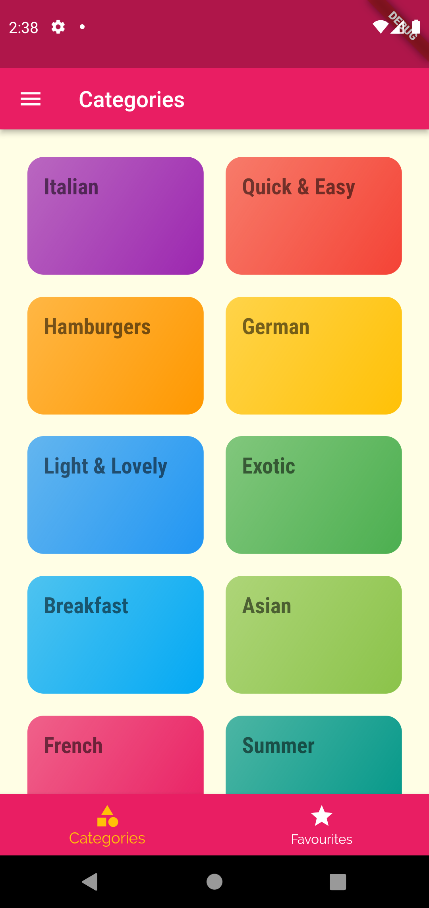
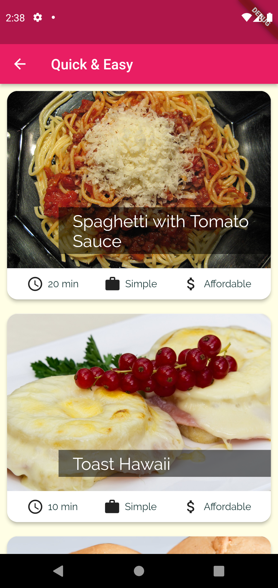
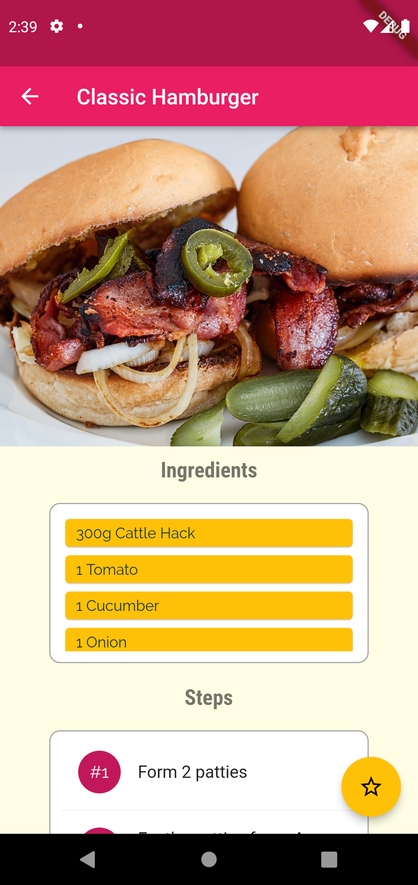

# Meal Recipes

- The Meal Recipes App is a frontend application developed using Flutter.
- It allows users to explore a wide variety of food recipes, sort them based on different filters, and mark their favorite recipes for easy access.
- [📦.apk](https://github.com/Akshit1903/MealRecipes/raw/main/app-release.apk) :For testing purposes
- [📽️YouTube](https://youtube.com/watch?v=1qBMQXQzjIc) Video

## Screenshots



## Features

- Recipe Collection: Access a vast collection of food recipes from different cuisines and categories.
- Recipe Filters: Filter recipes based on specific criteria such as ingredients, dietary preferences, or cooking time.
- Favorite Recipes: Mark recipes as favorites to quickly find and refer to them later.
- Detailed Recipe Information: Get detailed instructions, ingredient lists, and cooking tips for each recipe.
- User-Friendly Interface: The app provides a clean and intuitive user interface for easy navigation and a pleasant user experience.

## Technologies Used

- Flutter: A UI toolkit for building natively compiled applications for mobile, web, and desktop from a single codebase.

## Installation

- Clone the repository:
  ```shell
  git clone https://github.com/Akshit1903/MealRecipes
  ```
- Navigate to the project directory:
  ```shell
  cd MealRecipes
  ```
- Install the required dependencies:
  ```shell
  flutter pub get
  ```
- Configure a device and run the app

  ```shell
  flutter run
  ```

  Alternativly, you can download `.apk` file from <a href="https://github.com/Akshit1903/MealRecipes/blob/main/app-release.apk"> here</a> and follow the steps:

- Launch the Meal Recipes App on your mobile device.

- Browse through the recipe collection.
- Apply filters to refine the recipe selection based on dietary preferences.
- Tap on a recipe to view detailed information, including instructions, ingredients, and cooking tips.
- Mark recipes as favorites by tapping the heart icon to easily access them later.
- Explore different recipes, try new dishes, and enjoy cooking with the Meal Recipes App!
